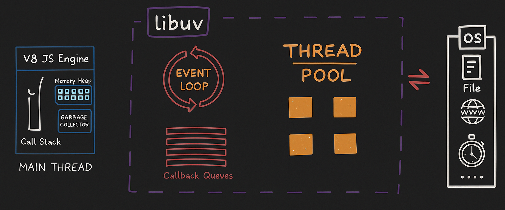
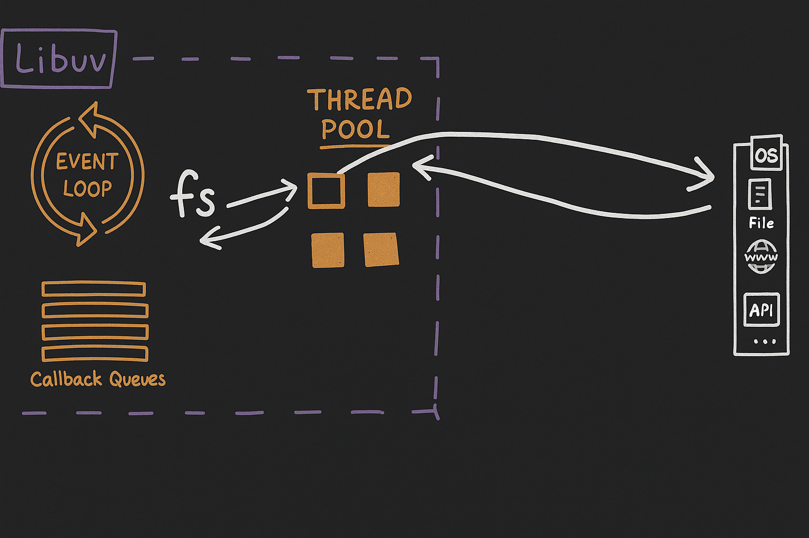
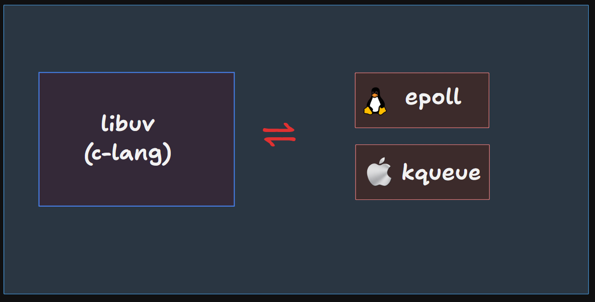

# Thread Pool
- Thread pool is like a collection of threads.



- Suppose you want to read a file. you can't read file at main thread because it can block to main thread. So, it offloads to libuv, now libuv find a thread inside thread pool. It get a thread and runs the file system using this thread pool. During operation, this thread can't do another operation. When file read is dome, it gives back and has been free to do another task.
- In node.js there are size of thread is `4` by default, known as `UV-THREADPOOL_SIZE`.
- Suppose there are 5 file reading opeartion request comes, the last request waits to empty thread, can't fullfil immediately.

---

### When libuv uses thread pool?
libuv uses thread pool when you doing following request:
- `fs`
- `dns.lookup`
- `crypto`
- `user specified input`

---

## Is node.js single threaded or multithreaded?
When you gives it synchronous code, it is single threaded, but you give asynchronous code, it work as multi-threaded.

---

### Code example of thread pool
- Suppose there are you generates 4 key using `crypto.pbkdf2`:

```js
crypto.pbkdf2("password", "salt", 5000000, 50, "sha512", ()=>{
    console.log("Key 1 generated");
})
crypto.pbkdf2("password", "salt", 5000000, 50, "sha512", ()=>{
    console.log("Key 2 generated");
})
crypto.pbkdf2("password", "salt", 5000000, 50, "sha512", ()=>{
    console.log("Key 3 generated");
})
crypto.pbkdf2("password", "salt", 5000000, 50, "sha512", ()=>{
    console.log("Key 4 generated");
})
```
- Now you add one more key generation operation, then it waits for a empty thread.
```js
crypto.pbkdf2("password", "salt", 5000000, 50, "sha512", ()=>{
    console.log("Key 5 generated");
})
```



---

### Changing Thread Pool size
```js
process.env.UV_THREADPOOL_SIZE = 5;
```

---

### Is API uses Thread Pool?
- Suppose you have a server. There all the networking happens on socket. Let you have a user request from our API, So it is making a `TCP` connection. Now you need a socket to incoming connection. Suppose there are multiple users come then you need to multiple socket. Here each socket has a `socket descripter`(File desctipter).
- Suppose you want to write some data in this connection i.e. this is a blocking operation, So you need a thread. It is known as **Thread per Connection Model**.
- Here multiple request, will these you make lot of thread?
- No, becuase instead of this, it handles by something inside OS known as `epoll`. It is a **scalable I/O event notification mechanism**.
- `epoll` -> `Linux` and `kqueue` -> `MacOS`



- There multiple request, then each have socket descripter, here you can create a epoll descripter that is **collection of socket descripters**. There 1 epoll descripter can handle all requests.
```
Hardware => Karnel => Process
              |
            epoll
```
- Suppose there is no read/write going connection, so, it is waiting ideal. There epoll descripter manage lot of connections becuase of notification mechanism, as soon as any acticity happen on connection, epoll descripter notify to libuv and libuv take care of it and execute it.

---

## Homework
Read about more following topics
- [How epoll and kqueue works? Also read about Data Structure of both.](./homework.md#epoll-vs-kqueue)
- [File Descripter](./homework.md#file-descriptor-fd)
- [Event emiters & listeners](./homework.md#event-emitters--listeners)
- [Streams & Buffer](./homework.md#streams--buffers)
- [Pipes](./homework.md#pipes)
- [`process.nextTick()` & `setImmediate()`](./homework.md#processnexttick-vs-setimmediate)
- [Timer uses Min Heap Data Structure](./homework.md#-timer--min-heap-data-structure)

--- 

## Some learnings
- Don't block the main thread.
    - sync mehtods
    - heavy JSON object
    - Complex REGEX
    - Complex calculation
- Data Structure is important
- Naming is very Important
- There's a lot to learn