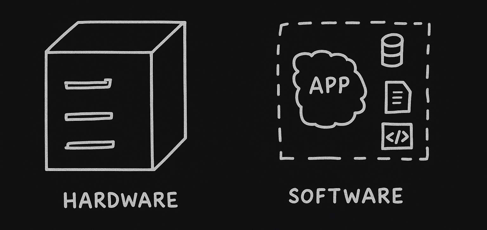
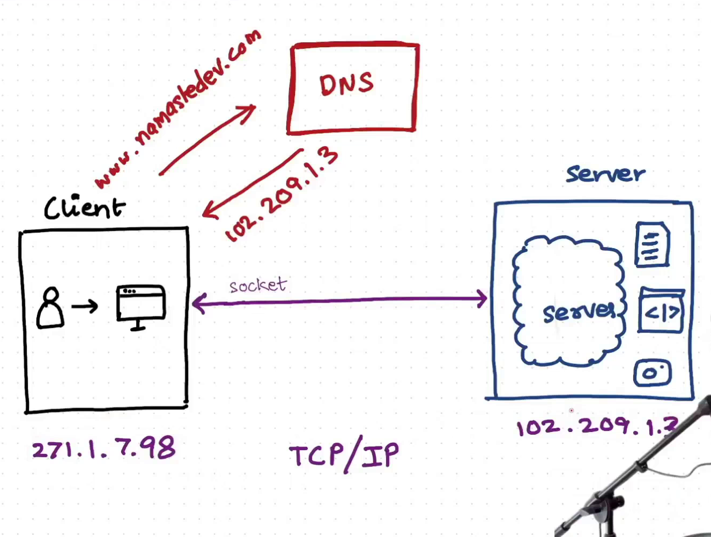

# Creating a Server

## Server
- A server can be both Hardware and Software:



### Hardware
- So, if somebody say **deploy your app to a server**, it is reffering to a hardware in that CPU that have RAM, Storage, Processor, etc. and running an OS. 
- It is kind of, **we running a application on OS and application does something that app can serve the client who wants to connect to a server.**
- To access data that store on this server(CPU) from outside world we need a way to make a connection, we need an app.
- For example, you creating a server on AWS, mean Amazon managing hardware and give rsources to you.
- **ec2 instance**: There must be a CPU which is somewhere on the internet, there managed by AWS, we hired that CPU for oueself and we have deploy website on server.

#### Can we use our Laptop or CPU as a server?
Yes, we can use our Laptop or CPU as a server, but there are some limitation:
| **Our Laptop** | **AWS Server** |
|------------|------------|
| Limited RAM and Storage | Can increase RAM & Storage |
| Can't maintain power & internet | 24x7 power and internet |
| `IP` can change | Reserved `IP` |
| No backups | Backups |
| Can't access from outside world | Can access from outside world |

### Software
Another is we create a server using software like **Node.js**, **Django**, etc., we creating a http server using these software means we creating an app that handle user requests and send response. So that app can call Server sometimes.

## Client Server Architecture
- Suppose there is a user that want to access files from a server, How can it do that?
- To access file a client opens a socket connection to server.
- Every client and server has a unique `IP` address. Client and server both are computers running their OS.
- When client send a request to server, there is somebody that listen this request on server. The app is known as **Server** because this app is listening the request and accordingly give access the file and it closes the socket connection. These request are known as **Incoming Request**.
- When a socket connection is made, it uses **TCP/IP** protocol.
- **IP (Internet Protocol)**: A way to locate and specify a computer that is connected to internet. It is like a address. Any `IP` can connect to an another `IP` that's why it is known as **Web**.
- **Protocol**: Some set of rules which are defined between computers to connect and communicate with each other.
- **TCP (Transmission Control Protocol)**: It is a protocol that is used to send data from one computer to another computer. It is a connection oriented protocol, means it establish a connection between two computers before sending data.
- **HTTP, FTP, SMTP servers**: When a client makes a socket connection to a server, there different protocols or rules which the send their response in.
    - `HTTP`: Hyper Text Transfer Protocol
    - `FTP`: File Transfer Protocol
    - `SMTP`: Simple Mail Transfer Protocol
- Web Server = HTTP Server


### How data sent by server
When you make a server request, data is not sent in one go, server send data in form of `chunks`(packets), It is like a **stream of chunks**.
- **Stream**: Connection
- **Buffer**: Sending data in chunks
- **TCP/IP**: Protocol to sending a data; control data transfer


## Domain Name System(DNS)
- Generally, we don't communicate with IPs, we use **Domain Name**. At the end, domain name maps to an IP.
- There one is a **verbal address**, but one more address is **Geo Location**(lattitide, langitude).
- Think IP as your geo-location and domain name as your verbal address.
- When we request a URL `www.abc.com`, but before making an API call to `abc.com`, internally it makes call to DNS server.



### Can we create multiple `http` servers?
Yes, according your need you can means there `2` or more apps running, each `http` server ha their `PORT` that decide to which `http` server can take request. Commonly `PORT` is a 4 digit number.

### Can a server have multiple internal server like `http`, `FTP`, `SMTP`, etc.?
Yes

### Real world Example
- Large scale companies don't deploy all application on a single server. They have different server for different services like `DB server`, `File server`, etc.
- According to user request, a server can aslo make connection to another server.
- If there DB server with your http server there can be some problems:
    - Performance Issues
    - Security Risks
    - Maintenance & Management Challenges
    - Scalability Problems
    ```
    Web server => Frontend + API Server
    DB server => Backend Storage
    ```


## Socket vs Web Socket
Both Socket and WebSocket enable communication between devices, but they serve different purposes and work in different ways.
| **Socket** | **Web Socket** |
| --- | --- |
| Works with TCP/UDP | Uses HTTP to establish, then switches to full-duplex TCP |
| Can be connection-oriented (TCP) or connectionless (UDP) | Persistent connection over TCP |
| Requires manual handling of packets, framing, etc. | Built-in message handling, less overhead |
| Closed after giving response | Stay longer, not closed automatic |
| One way connection | two way connection |

---

## Creating a Server in Node.js
Node.js has `http` module, it gives a method `createConnection()`. It gives an instance of a server, need to listen it and pass `PORT`. There `req` and `res`, 2 objects inside callback.

```js
const server = http.createServer(function(req, res){
	console.log("Running...");
	res.end("Hello World");
})

server.listen(7777);
```

*Congratulations, You have been created you first server.*

### Creating an API
```js
const server = http.createServer(function(req, res){
	console.log("Running...");
	
    // API -> /getSecretData
	if(req.url === '/getSecretData'){
		res.end("There is no secret data");
	}
	
	res.end("Hello World");
})

server.listen(7777);
```

- When you creating a server using `http` is not a best way. IT has lot of issues:
    - Becomes very complex
    - No Built-in Middleware Support
    - No Built-in Routing System
    - Manual Request Parsing Required
    - No Built-in Error Handling
    - No Built-in Security Features
- Commonly we use `express.js` to make `http` server, it a Node.js web app framework