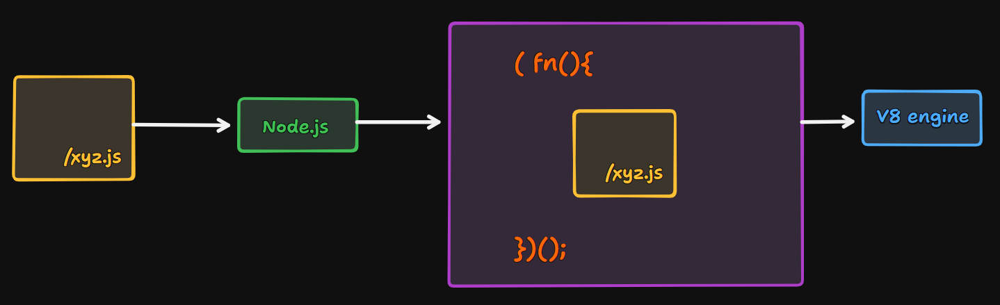

# Episode-05 | Diving into the NodeJS github repo

## Problems

### 1. Why we can't access variables and functions directly from a module?
**Ans.**: In JavaScript, functions have thier scope and their variables can't be accessed from outside of the function.
```js
function foo() {
    var a = 10;
    console.log(a);
}
console.log(a); // ReferenceError: a is not defined
```
Modules work same waay as functions. Whenever you create a module in Node.js, code that you write inside the module is wrapped inside function and then executed. This is why you can't access variables and functions directly from a module.

### 2. Whenever a module is require, What happen behind the scene?
**Ans.**: Whenever you require a module, Node.js took the code from file and **wrap code into a function and then execute**, so it not intefere with other code.
- **factorial.js**
    ```js
    function factorial(n) {
        if (n == 0 || n == 1) return 1;

        return n * factorial(n - 1);
    }

    module.exports = { factorial };
    ```

- **app.js**
    ```js
    const { factorial } = require("./factorial.js");

    var fact = factorial(6);
    console.log(fact);
    ```
- Here code is wrapped into a spacial function, is **IIFE** (**Immediately Invoked Function Expression**). Node.js is responsible for wrapping code into IIFE.
- **factorial.js**
    ```js
    (function (exports, require, module, __filename, __dirname) {
        function factorial(n) {
            if (n == 0 || n == 1) return 1;

            return n * factorial(n - 1);
        }

        module.exports = { factorial };
    })(exports, require, module, __filename, __dirname);
    ```

#### Need of IIFE
- Immediately invokes code.
- Keeps variables and functions safe.

### 3. How are variables and functions are private in different modules?
This is happen because Node.js wrap code into IIFE, and in JS, you can't access variables and functions from outside of the function.
```js
function foo() {
    var a = 10;
    console.log(a); // 10
}
console.log(a); // ReferenceError: a is not defined
```

### 4. How do you accessed module.exports?
When module code wrapped inside IIFE, there module object is **passed as parameter to IIFE**, and `require` function is also passed as parameter to IIFE. So, you can access module.exports from module object.



- *See below code*
    ```js
    (function (exports, require, module, __filename, __dirname) {
        function factorial(n) {
            if (n == 0 || n == 1) return 1;

            return n * factorial(n - 1);
        }

        module.exports = { factorial };
    })(exports, require, module, __filename, __dirname);
    ```
## 5 Step Mechanism of require function
`require(./path)`
- Resolving the path
    - `./localpath`
    - `.json`
    - `node:module`
    - `./folder`
- Loading the module
    - File content is loaded according to the file type.
- Compile the module
    - Wrap code into IIFE
- Code evaluation
    - `module.exports` is returned
- Caching
    - If you require same module again, then it will return from `cache`.
    - Improve performance

## `require` inside node GitHub repository
- [require funtion](https://github.com/nodejs/node/blob/main/lib/internal/modules/cjs/loader.js#L1483)
- [makeRequireFunction](https://github.com/nodejs/node/blob/main/lib/internal/modules/helpers.js#L127)
- [wrap function](https://github.com/nodejs/node/blob/main/lib/internal/modules/cjs/loader.js#L345)