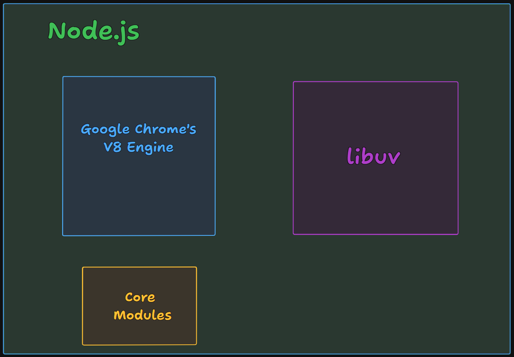
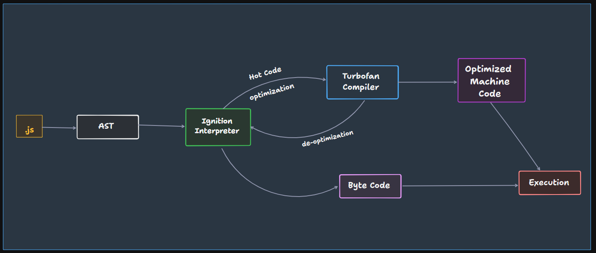

# Diving Deep into V8 engine

## Is JS a compiled or interpreted language?
There are 2 type of languages:
| Interpreted | Compiled |
| --- | --- |
| Read code line by line & execute | First compiles; HL code -> machine Code |
| Fast initial execution | Initially heavy but executed faster |
| Interpreter | Compiler |
| Ex. Python | C++ |

- But there are an another type of language they neither compiled nor interpreted, they use both. JS is one of them.
- JS engine is Interpreter and also it has a compiler. This type of compilation known as **Just-In-Time(JIT) Compilation**.

## Architecture of Node.js
There are 2 main components of Node.js:
- V8 engine
- libuv
There also other components like modules, etc.

## V8 engine
V8 engine a JavaScript engine developed by Google for the Chrome browser. It is written in C++ and used in Chrome and Node.js. It is open-source and can run standalone, or can be embedded into any C++ application.

### Working of V8 engine
Suppose you have a JS code, when this code given to V8, There are saveral steps to execute the code:
1. **Parsing**: There are 2 steps:
    - **Lexical Analysis**: Code broken down into tokens i.e. small pieces. It also know as **Tokenization**. Ex. `var a = 10;` will be broken down into `var`, `a`, `=`, `10`, `;`.
    - **Syntax Analysis**: A abstract syntax tree is created from the tokens. It is a tree representation of the code. This is also known as **Syntax Parsing**, and this whole step known as **Parsing** becuase of syntax parcing.
    - [**AST Explorer**](https://astexplorer.net/): It a tool there you can see the AST of your code.
    - When JS engine unable to convert your code into AST, it will throw a syntax error.

2. **JIT Compilation**: 
    - In V8 engine, there is the **Igition interpreter**. AST given to Ignition that convert AST into byte code. one's code has been converted into byte code, execution starts of byte code.
    - In V8 engine, there is also **Turbofan Compiler**. If there a portion of code that executed again and again, means code that used multiple time, it can be a function that called again and again. Ignition gives this code to Turbofan, so that turbofan can compile and optimize the code. So when it executes next time, we can get result very fast.
    - This type of code known as hot code, and this process known as optimization.
    - **Optimization**: Turbofan compile to hot code, so after compilation, it can run fast and Turbifan optimise to machine code. Now it again executed fast.
    - **Deoptimization**: In this process, there are chances to deoptimize the code.
    - **Example of deoptimization**: Duppose you have a `sum()` function in your code that used multiple times. So it executed again and again than Ignition offloads it to Turbofan. While the optimization the code, Turbofan can make assumptions. Suppose you have `sum()` function with parameters `a` and `b`. You make function calls like:
        - `sum(4, 6)`: Turbofan optimizes the code for this call.
        - `sum(51, 23)`: It executed very fast.
        - `sum(41, 12)`: It again executed very fast.
        - `sum('k', 'l')`: Now you pass `char` into `sum()` function, there optimization will fail, because Turbofan optimize `sum()` function for `numbers`, but here you pass `char`, then Turbofan realize that I optimize to code for `number`, but there are `char`, my optization might be incorrect. Now it will deoptimize the code to Ignition that convert code into machine code and it executed.
    - There are also **Inline chache**, and **Copy Eusion**. So read about it.
    - There was the **CrankShaft compiler** in the old version of V8 engine, but now it has been replaced by Turbofan.

3. **Garbage Collocton**: There is also another job that is Garbage Collection done by V8 in parallel. There are following type of Garbage Collectors
    - Orinoco
    - Oil Pan
    - Scanvenger
    - MCompact
    - Explore all these

## Resources
- [AST Explorer](https://astexplorer.net/)
- [Turbofan Compiler Github](https://github.com/v8/v8/tree/main/src/compiler)
- [Turbofan Compiler Docs](https://v8.dev/docs/turbofan)
- [Ignition Interpreter Github](https://github.com/v8/v8/tree/main/src/interpreter)
- [Ignition Interpreter Docs](https://v8.dev/docs/ignition)
- [Byte Code Examples](https://github.com/v8/v8/tree/main/test/unittests/interpreter/bytecode_expectations)
- [V8 Engine Blogs](https://v8.dev/docs)
- [V8 Engine Docs](https://v8.dev/blog)
- [Firing up the Ignition Interpreter](https://v8.dev/blog/ignition-interpreter)