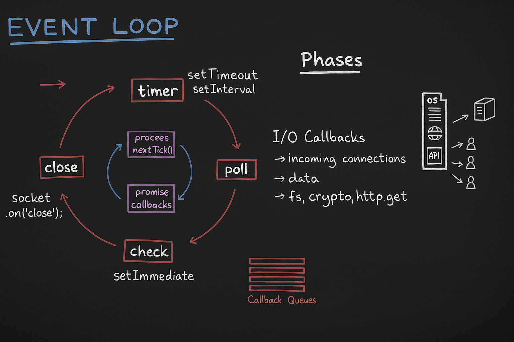

# libuv 💀💀
- Async and non-blocking I/O operations possible bacause of libuv in Node.js.
- Suppose you are reading a file, then it offloads to libuv by V8 engine. libuv talk to OS to getting the data back. ones the data is back, it is libuv's job to take callback function and give it to V8.

## Working of libuv
In libuv, there are 3 main components:
- Event loop
- Callback Queue
- Thread Pool


### Callback Queue
Suppose the data comes back very fast, and JS engine still busy to runnning JS code, then the callback function of `readFile` waiting in **Callback Queue** inside libuv till callback not empty of V8. If there are an API call, a read file, and also a `setTimeout`. Suppose all comes back at same time then libuv maintain a callback queue and all sync I/O callback wait in their respected queue, if there JS engine is busy.

### Event loop
- The job of event loop is to keep checking callstack and callback queue.
- Suppose their a task waiting in callback queue, and event loop take a task and pushed to callstack as soon as possible when callstack is empty. If there are multiple callbacks are waiting in callstack queue, then it is job of event loop to manage all callback queues and push them to callstack in correct order and at correct time.

#### Working of Event loop
Event loop runs in a loop. There are 4 major phases in event loop:
- Timer Phase
- Poll Phase
- Check Phase
- Close Phase



1. **Timer Phase**: Initially event loop is in timere phase. There all the callbacks which are set by `setTimeout` or `setInterval` are executed in this phase. Event loop check there is some callbacks associated with timer. Suppose if the timer has expired, now the callback waiting into timer queue. Event loop first prioritize the timer callbacks and push them to callstack. After that it move ti the poll phase.

2. **Poll Phase**: In the poll phase, all the callbacks are associated with the I/O callbacks with the executed. Most of the task executed in Poll phase. There are following callbacks:
- Incoming connections
- Data
- `fs`, `crypto`, `http`, etc.

3. **Ckeck Phase**: All the callbacks which are scheduled with the `setImmediate` and waiting in the callback queue will be executed in this phase.

4. **Close Phase**: There all close operation done in close phase. Suppose we have opened a `socket`, now you want to close it, so handling the `socket` will cloasing in this phase.

- The event keep running in this cycle and meanwhile, it also checking weather the callstack is empty or not. If the callstack is empty, it quickly assign whole callback in the following cycle.

- **Inner Cycle**: Before evry phase event loop follow an inner cycle:
    - `process.nectTick()`: This is a way of handling operation, we can schedule callbacks using it.
    - `Promise.resolve()`: Suppose we have a Promise and it resolved, noow there is a callback is executed, So promise callback executed here.
    - Both executed before the next phase.
    - It is like a priority cycle.

    

### Q. In ideal case, in which phase event loop waits for the  task that running?
Suppose there is nothing in callback queue, but still file reading is going on that was the phase, callback is empty mean event loop is in ideal state, then it **waits in poll phase**, when something comes in callback queue, it start executuin again. It also known as **Semi-infinite loop**.
- Event loop can be different in browser and in Node.js also very different.
- If there an nested `nextTick`, then these are executed first before going to another task.

#### Example
- Suppose we have following task there:
```js
process.nextTick(cb);
promise.resolve(cb);
setTimeout(cb, 0);
setImmediate(cb)
fs.readFile('file.txt', cb);
https.get('url', cb);
```
There are waiting in their respective queue. Now the order to execute of these:

- [Example 1](./ex1.js)

```js
const a = 100;
setImmediate(()=> console.log("setImmediate"));

fs.readFile("./data.txt", "utf8", ()=>{
    console.log("File read.");
})

setTimeout(()=>{
    console.log("setTimeout");   
}, 0);

function printA(){
    console.log("a = ", a);
}

printA();
console.log("Last Line");
```
- Output:
```bash
$ node ex1.js
a =  100
Last Line
setTimeout
setImmediate
File read.
```
- [Example 2](./ex2.js)
- [Example 3](./ex3.js)
- [Example 4](./ex4.js)
- [Example 5](./ex5.js)
  - *Output*:
    ```bash
    $ node ex5.js
    a =  120
    Last Line
    process.nextTick
    Promise
    setTimeout
    setImmediate
    setImmediate
    Secret data:  This is secret file.
    inner process.nextTick
    inner setImmediate
    inner setTimeout
    again Secret data: This is secret file.
    ```
    - *Explanation*:
      - At inner `nextTick`, there is a file reading opearation that take some time to read file, so even loop goes to next phase that is Check phase and there is a inner `setImmediate`, so it executed first. then inner `setTimeout` and then again file reading operation.

### Other 2 phases of Event loop
There are 2 more phases of event loop between timer and poll phase:
#### 1. Pending Callback Phase
- Executed I/O callbacks deferred to the next loop iteration.
- Suppose over there for any reason these I/O callnacks can be deferred into next loop event cycle.
- So, suppose if there is some error, or you want to retry something, or there can be recursive callback, but there is a limit of recursive callbacks, to reduce starvation some time we defer these callbacks to the next loop iteration.
- **1 Tick = one cycle of event loop**

#### 2. **Idle, Prepare Phase**
It only used internally, we as a developer don't have to worry about it.

#### before going to poll phase
- Before going to poll phase, it actually calculate, what is the timer of `setTimeout` and `setInterval` that need to executes, if it take 5 sec, then event loop waits in poll phase till 5 sec, and after it move next to execute time queue and come back again into poll phase.

## Resources
- [Event loop](https://nodejs.org/en/learn/asynchronous-work/event-loop-timers-and-nexttick)
- [I/O loop](https://docs.libuv.org/en/v1.x/loop.html)
- [Event loop Code](https://github.com/libuv/libuv/blob/v1.x/src/unix/core.c#L427)