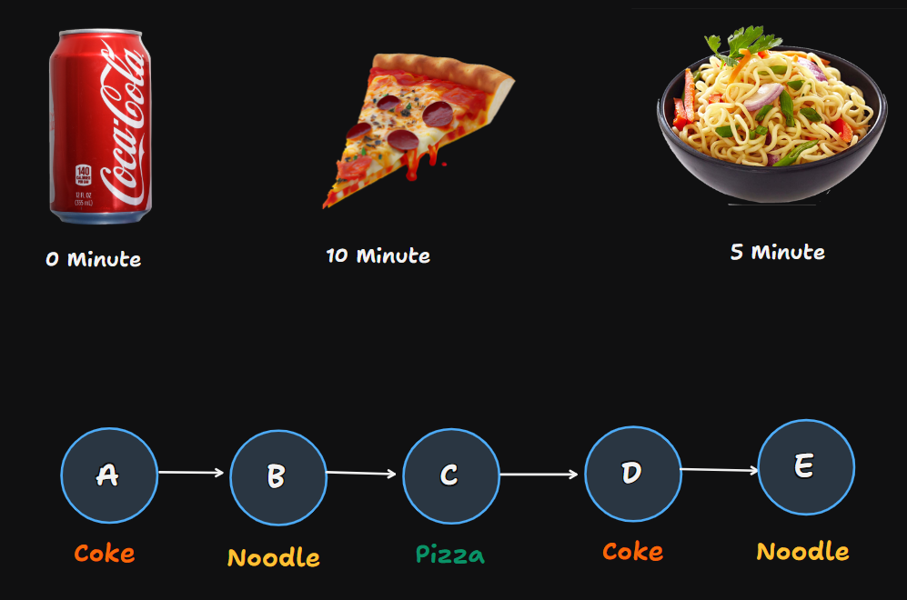
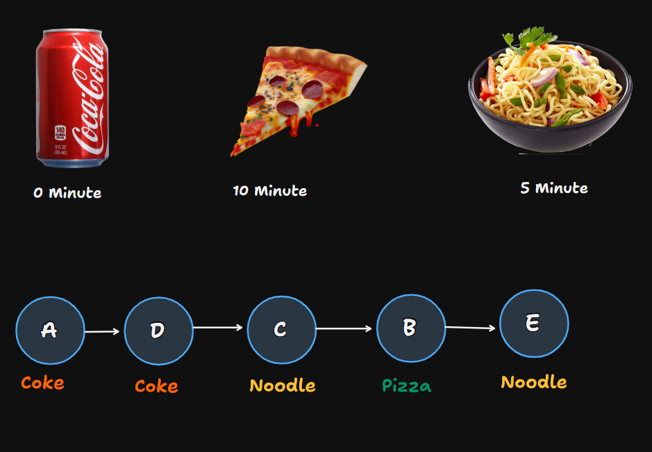
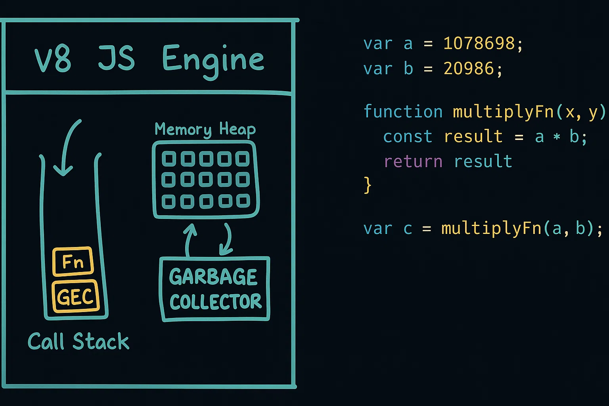
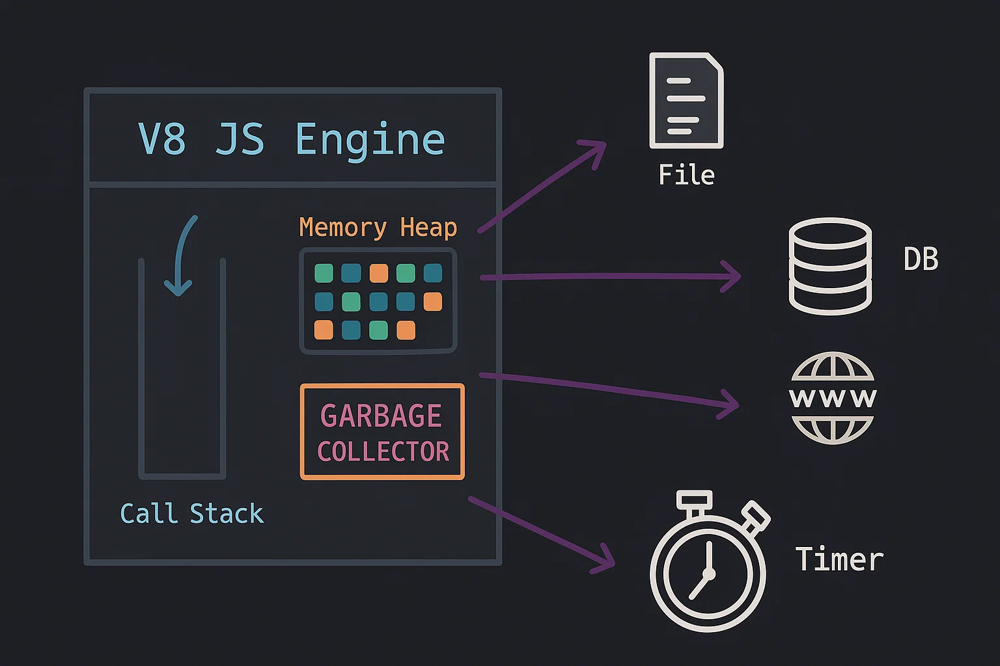
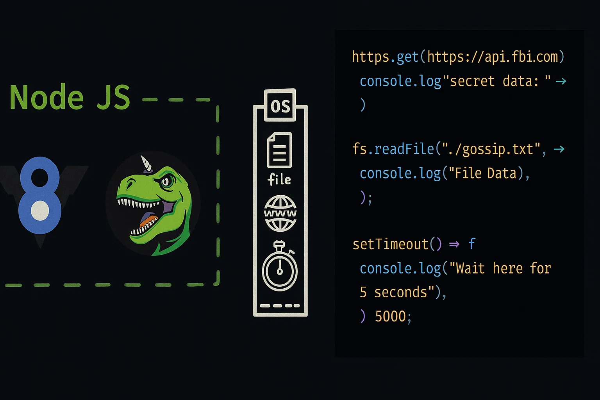
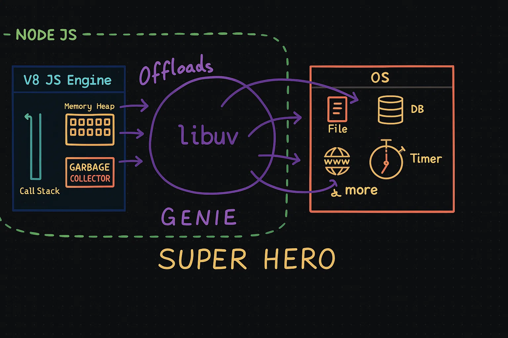
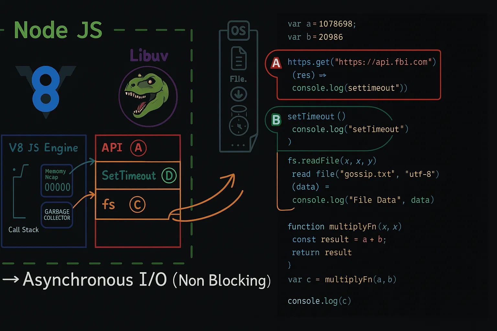

# Episode-06 | libuv & async IO

- **Node.js has an event-driven architecture capable of asynchronous I/O.** What does that mean?

- To understand it, need to come on JavaScript.

## JavaScript
- JavaScript is a single-threaded synchronous language.
- Here, synchronous means operations are executed one after another.
- There is only one thread and V8 engine running on it, and executes the JS code.
- Let there is a file that contains JS code, when it executed, V8 engine took the code and executed it line by line.
- **Thread**: Suppose in OS, you have lot of processes running, inside them, **Thread is a like a container where you can run any process.** There is C++ program running in a separate thread, and JS code running in a separate thread.

### Single-threaded and Multi-threaded
- **Single-threaded**: Only one thread is there, and it executes the code line by line. Example: JavaScript.
- **Multi-threaded**: Multiple threads are there, and they execute the code parallelly. Example: C++.

## Problem with Single-threaded
- Let it get multiple requests at the same time. How will it handle them? Will there block these requests?
- To understand this, need to understand synchronous and asynchronous.

## Synchronous and Asynchronous
### Example
- Suppose you running a Restraurant, and you have a counter for order. There are 3 items in menu: **Coke**, **Pizza**, and **Noodles**.
- Let there following time taken by each item to prepare:
  - **Coke**: 0 minute
  - **Pizza**: 10 minutes
  - **Noodles**: 5 minutes
- There are 5 people waiting in queue to order. They ordered:
  - **Person A**: Coke
  - **Person B**: Pizza
  - **Person C**: Noodles
  - **Person D**: Coke
  - **Person E**: Pizza

### Synchronous
- Let you running in synchronous way.
- Here is the order of serving:
  - **Person A**: Coke
    - Time taken: 0 minute
    - Waiting time: 0 minute
    - Took and gone out from queue after 0 minute
  - **Person B**: Noodles
    - Time taken: 5 minutes
    - Waiting time: 5 minute
    - Gone out from queue after 5 minutes
  - **Person B**: Pizza
    - Time taken: 10 minutes
    - Waiting time: 15 minute
    - Gone out from queue after 15 minutes
  - **Person D**: Coke
    - Time taken: 0 minute
    - Waiting time: 15 minute
    - Gone out from queue after 15 minutes
  - **Person E**: Noodle
    - Time taken: 5 minutes
    - Waiting time: 20 minute
    - Gone out from queue after 20 minutes
  - There order fullfil in a sequence, and they have to wait for their order.
  ```
  A -> B -> C -> D -> E
  ```



- After these suppose another peple join queue, then they have to wait a long time to get their order.

### Asynchronous
- Let you running in asynchronous way.
- There each people order and gone out from queue to waiting area. 
- Here is the order of serving:
  - **Person A**: Coke
    - Time taken: 0 minute
    - Waiting time: 0 minute
    - Took and gone out from queue after 0 minute
  - **Person B**: Pizza
    - Time taken: 10 minutes
    - Waiting time: 10 minutes
    - Gone out from queue after 10 minutes
  - **Person C**: Noodle
    - Time taken: 5 minutes
    - Waiting time: 5 minutes
    - Gone out from queue after 5 minutes
  - **Peason D**: Coke
    - Time taken: 0 minute
    - Waiting time: 0 minute
    - Gone out from queue after 0 minute
  - **Person E**: Noodle
    - Time taken: 5 minutes
    - Waiting time: 5 minutes
    - Gone out from queue after 5 minutes
  - There peple order and gone out from queue to waiting area, and they can do other work, When their order is ready, they will be called.
  ```
  A -> D -> C -> B -> E
  ```



### Conclusion
| **Synchronous** | **Asynchronous** |
| --- | --- |
| Code quickely executes | Code take some time to executes |
| Blocking operation | Non-Blocking opearation |
| Not good for I/O operations | Good for I/O operations |
| JS is synchronous | Node.js is asynchronous |
| Ex. `var name = "Rahul"` | Ex. `fs.readFile('file.txt', function(err, data) {})` |

### Synchronous and Asynchronous Code
- **Synchronous code**:
  ```js
  // Synchronous
  var a = 100;
  var b = 205;

  function multiply(a, b){
      return a*b;
  }

  console.log(multiply(a,b)); // 20500
  ```

- **Asynchronous code**:
  ```js
  const https = require('https');
  const fs = require('fs');

  https.get("https://api.xyz.com", (res)=>{
      console.log("Data from xyz APIs", res.data);
  });

  fs.readFile("./dev.txt", (data)=>{
      console.log("Data from dev.txt file: ", data);
  });

  setTimeout(() => {
      console.log("Call it after 5 second");
  }, 5000);
  ```

### How is synchronous code executed?
In JS engine following componet is responsible for executing the code:
- **Callstack**: JS engine have a Callstack that running on a single thread.
- **Memory Heap**: There also a Memory Heap that allocate memory to variables and functions.
- **Garbage Collector**: There is also a Garbage Collector that clear the unused memory and collect it.

- Whenever you run the code, a **Global Execution Context** is created, and it is pushed to the Callstack. There memory allocation and garbage collection done in parallel. When you call a function, an another **Function Execution Context** is created and pushed to the Callstack. When the function is executed, it is popped from the Callstack. Ones the code is executed completely, the **Global Execution Context** is popped from the Callstack.



### How asynchronous code is executed?
- JS engine does not know how to wait, it not have the concept of timer. But with Node.js, it work and wait to complete the task. This is possible because Node.js give some superpowers to JS engine.



- Suppose you need to access a file that store in OS, then JS code talk to OS to access the file, but how?
- There is **`libuv`** is make connection between JS engine and OS or Database. So, JS engine not talk direcly to OS, it talk to `libuv`, and `libuv` talk to OS, get the response and hand over to JS engine.



- JS engine offloads all asynchronous task to libuv.



## **libuv**: 
- libuv is a multi-platform C library that provides support for asynchronous I/O based on event loops, it makes async I/O simple.
- **libuv** is like a **Superhero** that manage superpowers of Node.js.
- libuv is a very core thing in Node.js, it is responsible for handling the async I/O operations.



---

[**Previous**](../S01%20Episode%205/README.md) | [**Next**](../S01%20Episode%207/README.md)