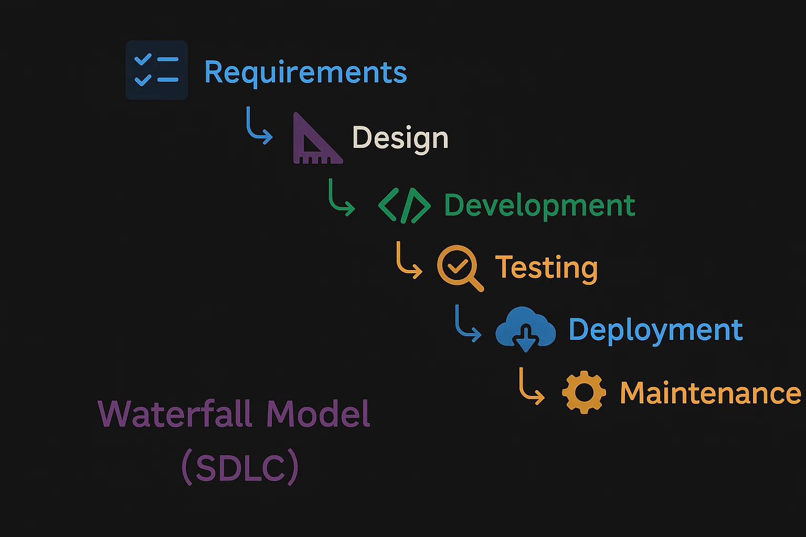
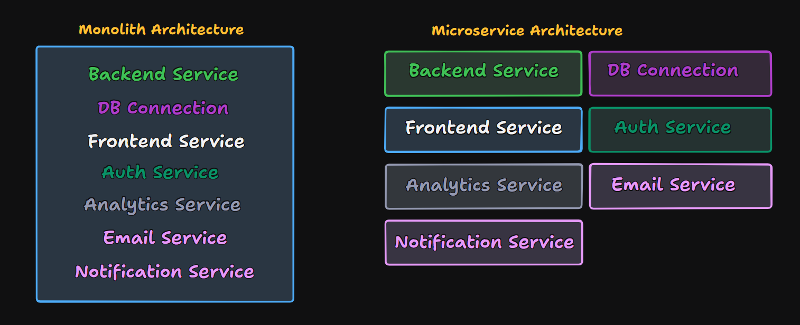
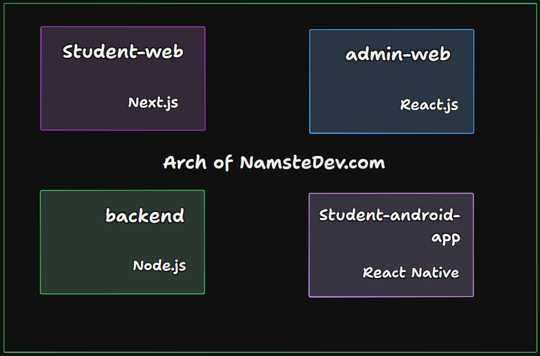

# Episode-01 | Microservices vs Monolith - How to Build a Project

## Software Development Life Cycle (SDLC)
Software Development Life Cycle (SDLC) is a process used by the software industry to design, develop and test high quality softwares. The SDLC aims to produce a high-quality software that meets or exceeds customer expectations, reaches completion within times and cost estimates.

### Waterfall Model
The Waterfall Model is a sequential design process, often used in software development processes, in which progress is seen as flowing steadily downwards (like a waterfall) through multiple phases. Here are the phases of the waterfall model:

1. **Requirement Analysis**: In this phase, there are lot of information gathered about the product like **what we build**, **features**, **tech stack**, **audiences**, etc. The job of requirement analysis is Project Manager(PM) and he also take help of designers to create a mockup of the product.
2. **System Design**: This is not exactly the UI design. You have not start writing code on first day, there will be a design document created by tech team(Senior Engineer and Engineering Manager), they collectively design the document. Here design means:
    - Defining the architecture of the system
    - Understanding the requirements
    - Thinking about the tech stack
    - High & low level design
3. **Development**: This is the phase where actual coding happens. The developers start writing code based on the design document created in the previous phase.
4. **Testing**: After the development is done, the product is tested by the Testing team. They check if the product is working as expected and if there are any bugs. They test the product manually and also use automated testing tools by writing test cases. Developers also write test cases for unit testing.
5. **Deployment**: After the product is tested and all the bugs are fixed, it is deployed to the production environment. This is the phase where the product is made available to the users. This is done by DevOps team, they take care about server, database, etc.
6. **Maintenance**: After the product is deployed, it is monitored for any issues. If there are any bugs or issues, they are fixed in this phase. This is an ongoing process and the product is continuously improved based on user feedback. The whole process is repeated for the next version of the product.

## Monolith vs Microservices
### Monolith
Monolith mean there one big project does everything. It is a single codebase that contains all the features of the product. It has:
    - Database Connection
    - Backend Code
    - Frontend Code
    - Deployment Scripts
    - Auth Code

There are lot of companies follow it, there a large repository and developers work on same repo.

### Microservices
Microservice is a software architecture there are multiple small services and each service has their job. Each service is independent and can be developed, deployed and scaled independently. Each service has its own codebase and database. It has:
- Frontend Service on different repository
- Backend Service on different repository
- Database Service on different repository
- Deployment Scripts on different repository
- Auth Service on different repository

- **service**: There service word loosely used for a project or application. It can be a backend service, frontend service, mobile app, etc.
- Now in industry, there are lot of companies consider microservices as a best practice because it gives you more flexibility and scalability.

#### Monolith vs Microservices → For Large Projects
| **Feature** | **Monolith** | **Microservices** |
| --- | --- | --- |
| **Development Speed** | Slower | Faster |
| **Code repo** | Single repo | Multiple repos |
| **Scalability** | Limited | High |
| **Deployment** | Single deployment (tough) | Independent deployment (Easy) |
| **Tech Stack** | Single tech stack (restricted) | Multiple tech stacks |
| **Infra Code** | Lower | Higher |
| **Complexity** | Tough | Easy |
| **Fault isolation** | No | Yes |
| **Testing** | Easy | Hard |
| **Ownership** | Central | Distributed |
| **Maintenance** | Hard | Easy |
| **Debugging** | Easy | Hard (Blame Game) |
| **Dev Experience** | Bad | Good |

## What happen in NamasteDev.com?
NamasteDev.com have not lot of microservices, it have 3 microservice now, **student-app**, is student application which used by students to access the courses, it is written in Next.js. Another is **admin-app** written in React.js, it is used by admin to manage the courses. Also they have **Backend** written in Node.js, it is used to handle the API requests and database operations. They are also building **student-mobile-app** in React Native.

## What are we going to build in devTinder?
We are building 2 microservices in devTinder:
- devTinder-frontend
= devTinder-backend
