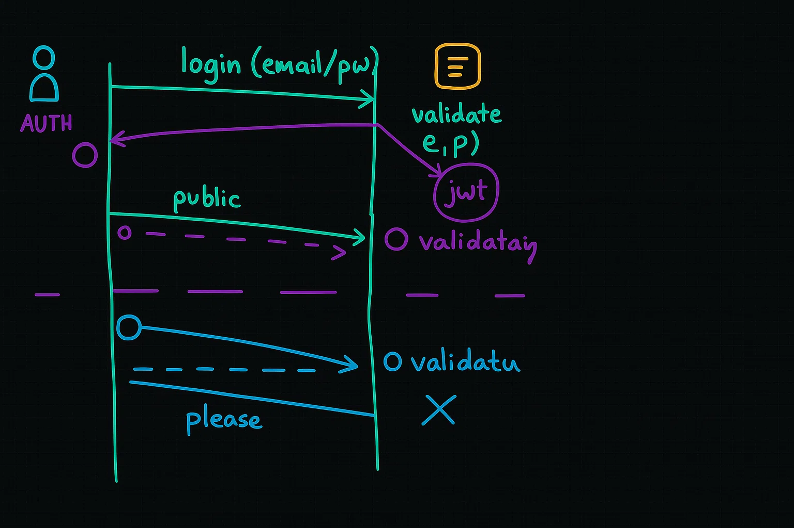

# Episode-10 | Authentication, JWT & Cookies

When a user wants to communicateto server, it creates a connection, there is TCP/IP protocol that used to create this connection, both client and server have their own IPs. Let's suppose user send a request to get it's profile data from server, server send the data and connection is closed.

---

## Q. What do you mean of login?

Everytime, when a user make an API call(request), it needs to validate user, whether request coming from authorized source or not, so the user should be logged in.

When user send a request to login with their credentials, then server validate users credential and send back a JET (JSON Web Token) token. The user saved the JWT token and every time when user send request to server JWT token will be sent with request and server validate this token every time.



---

## Storing JWT Token

Storing JWT token is tough job and again and again sending it with API. To tackle this web comes with the solution named cookies. Whenever login request came to server it sent successfull response along with JWT token inside cookies.

Cookies have expiry date, let a cookie is stored, it has been expired and still you request to server with this cookie, this cookie failed to validate and you have receive message "please log in" and redirected to login page.

---

### Writing Code for Cookies

The logic for cookieswritten after user credential has been validated and JWT token has been created. `ExpressJS` provides a method `res.cookie()` to set cookies. It takes three parameters, first is the name of cookie, second is the value of cookie and third is the options object. The options object can have properties like `expires`, `httpOnly`, `secure`, etc.

```javascript
app.post("/login", async (req, res) => {
  const { email, password } = req.body;
  // Validate user credentials

  if (validCredentials) {
    // Create JWT token
    const token = "dkmgogbndfbmtghh565963fdg63fbfb6fb35bdb";
    // Set cookie
    res.cookies("token", token);
    res.send("Login successful");
  } else {
    res.status(401).send("Invalid credentials");
  }
});
```

---

## GET /profile API

When user request to their profile then cookie sent along with request and we can read it from request object, but we can't read it directly, need to parse it otherwise we got undefined. For parsing install the `cookie-parser` middleware.

```bash
npm install cookie-parser
```

Then use it in your application:

```javascript
const cookieParser = require("cookie-parser");
app.use(cookieParser());
```

Now you can access the cookies from the request object:

```javascript
app.get("/profile", (req, res) => {
  const token = req.cookies.token; // Access the cookie
  if (!token) {
    return res.status(401).send("Please log in");
  }

  // Validate the token and get user profile

  res.send(user);
});
```

---

## JWT Token

JWT tokens are an open industry standard RFC 7519 method for representing claims securely between two parties. JWT tokens are used to verify the authenticity of the user and to ensure that the user is authorized to access the requested resource. JWT tokens are signed using a secret key, which is known only to the server. The token contains three parts: `header`, `payload`, and `signature`. The header contains the type of token and the signing algorithm used. The payload contains the claims, which are the data that you want to send to the client. The signature is used to verify that the token has not been tampered with.

There is `jsonwebtoken` package for creating JWT tokens:

```bash
npm install jsonwebtoken
```

---

### Creating JWT Token

To create a JWT token, use the `sign()` method from the `jsonwebtoken` package. It takes three parameters: the payload, the secret key, and an options object.

```javascript
const jwt = require("jsonwebtoken");

app.post("/login", async (req, res) => {
  const { email, password } = req.body;
  // Validate user credentials
  // Find the user in the database

  if (validCredentials) {
    // Create JWT token
    const token = await jwt.sign({ _id: user._id }, "YOUR_SECRET_KEY");
    // Set cookie
    res.cookies("token", token);
    res.send("Login successful");
  } else {
    res.status(401).send("Invalid credentials");
  }
});
```

---

### Verifying JWT Token

To verify the JWT token, use the `verify()` method from the `jsonwebtoken` package. It takes two parameters: the token and the secret key.

```javascript
app.get("/profile", (req, res) => {
  const token = req.cookies.token; // Access the cookie
  if (!token) {
    return res.status(401).send("Please log in");
  }

  // Validate the token and get user profile
  const payload = jwt.verify(token, "YOUR_SECRET_KEY");
  if (!payload) {
    return res.status(401).send("Invalid token");
  }

  // Find the user in the database using payload._id

  res.send(user);
});
```

---

## Authentication Middleware

Almost APIs of application uses authentication to give response except `/login` & `/signup` APIs. To avoid writing the same code again and again, we can create a middleware function that will check if the user is authenticated or not. If the user is authenticated, then it will call the next middleware function, otherwise it will return an error response.

```javascript
const userAuth = (req, res, next) =>{
    try {
        // Reading Token
        const { token } = req.cookies;

        // validating the token
        const payload = await jwt.verify(token, "TINDER@Dev$");

        const { _id } = payload;

        // handling the case if '_id' is not their
        if (!_id) {
        res.status.send("Invalid token");
        }

        // finding the user by userId
        const user = await User.findById(_id);

        // Haadling the case if user not found
        if (!user) {
            throw new Error("User not found");
        }
        req.user = user;

        next();
    } catch (err) {
    res.status(400).send("ERROR: " + err.message);
    }
}
```

---

## Setting up expiration time for JWT token & cookies
**JWT token** can be set to expire after a certain time. This is done by passing an `expiresIn` option to the `sign()` method when creating the token.

```javascript
const token = await jwt.sign({ _id: user._id }, "YOUR_SECRET_KEY", {
  expiresIn: "7h", // 7d is standard time to expire the token
});
```
**Cookies** can also be set to expire after a certain time. This is done by passing an `expires` option to the `res.cookie()` method when setting the cookie.

```javascript
res.cookie("token", token, {
  expires: new Date(Date.now() + 7 * 24 * 60 * 60 * 1000), // 7 days
});
```
- The expiry date is look like this inside cookie:
```bash
token=HEADER.PAYLOAD.SIGNATURE; Path=/; Expires=Sat, 14 Jun 2025 13:04:34 GMT;
```

---

## Schema methods in Mongoose
Schema methods are functions that are defined on the schema and can be used to perform operations on the documents of that schema. They are useful for encapsulating logic that is related to the schema and can be called on the documents of that schema.

- **`getJWT()`**: When a user logged in, it creates a JWT and passing the id and the `sign()` method is very closely to user. Instead of signing the token in `/login` API, we can get this function from schema methods. you can create helper functions, this is best practice.

```javascript
const userSchema = new mongoose.Schema({
  // schema definition
});

userSchema.methods.getJWT = async function () {
  const user = this;
  const token = await jwt.sign({ _id: user._id }, "TINDER@Dev$", {
    expiresIn: "7d",
  });
  return token;
};
```
- Now you can call this method on the user document to get the JWT token.

```javascript
const token = await user.getJWT();
```

- **`validatePasswordHash()`**: When a user logs in, it needs to validate the password hash. Instead of validating the password hash in `/login` API, you can create a method on the schema to validate the password hash.

```javascript
userSchema.methods.validatePasswordHash = async function(plainPasswordFromUser){
  const passwordHash = this.password;
  const isPasswordMatchedWithHash = await bcrypt.compare(plainPasswordFromUser, passwordHash)
  return isPasswordMatchedWithHash;
}
```
- Now you can call this method on the user document to validate the password hash.

```javascript
const isPasswordMatched = await user.validatePasswordHash(password);
```