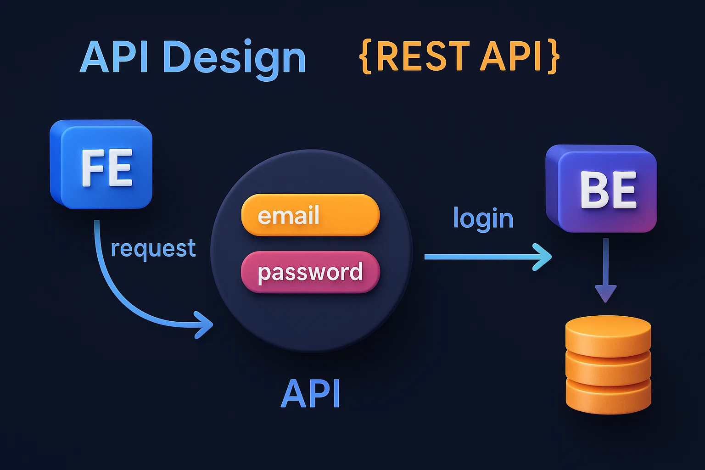

# Episode-02 | Features, HLD, LLD & Planning

## Requirement Analysis
Here are the following features that we will be implementing in this project:
- Create an account
- Login to the account
- Update account details
- Feed page -> Explore page
- Send connection request
- See our matches
- See the requests we've sent/received
- Accept/Reject connection requests

*Also there are more feature that we decide later.*

---

### Technology Planning
We build 2 microservices for this project:
- Frontend Service: ReactJS
- Backend Service: NodeJS with ExpressJS

After the planning, SDEs come into the picture and start building things, but not start writing code yet, they will do Low Lwvwl Design.

---

## Low Level Design 
Low-Level Design refers to the process of designing the internal workings of individual components in a software system. If you give time for planning, it make development easier and faster.

When Backend service has been built, now first important thing is `Database Design` and second is `API Design`.

---

### Database Design
Let you choose MongoDB for database design, than think about `collections` and `fields` that you need to store in the data of the application.
- User is an entity and there are multiple users, they have connections between them, this known as **Connection Request**. When you have this type of model, there userscan send request to another users, you need to store this relationship also. So there you need 2 collections:
    - **User Collection**: username, email, password, profile picture, bio, etc.
    - **Connection Request Collection**: senderId, receiverId, status, timestamp, etc.
- A project can be designed differently by different people because everyone has their own way of thinking.
```
status can be one of the following:
        A ------> B
          /      \
    pending     ignored
     /    \
accepted   rejected
```

---

### API Design
We use `REST API` for this project. REST (Representational State Transfer) is a way to communication between 2 systems over HTTP like frontend and backend.



#### HTTP Methods of REST API
- `GET`: Retrieve data from the server.
- `POST`: Send data to the server.
- `PUT`: Update existing data on the server.
- `PATCH`: Partially update existing data on the server.
- `DELETE`: Remove data from the server.

### What all APIs we need for devTinder?
| **Method** | **API Name** | **Description** |
|------------|--------------|-----------------|
| POST | `/signup` | Create a new user account |
| POST | `/login` | Authenticate user and return token |
| GET | `/profile` | Get user details by ID |
| PUT | `/profile` | Update user details |
| PATCH | `/profile` | Update user profile picture |
| DELETE | `/profile` | Delete user account |
| POST | `/sent-requests` | ignored or interested in a connection request |
| POST | `/review-requests` | Accept or reject a connection request |
| GET | `/connections` | Get all connections of the user |
| GET | `/requests` | Get all connection requests sent/received by the user |