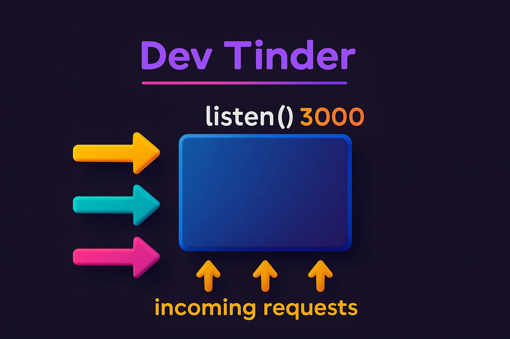

# Episode-03 | Creating our Express server

## Init the Node.js project

First of all, you need to define the configurations of project. Run the following command in your terminal:

```bash
npm init

# This command creates a package.json file in your project directory.
```

- answer all the questions, or just press enter to accept the defaults.
- Now, create a file `src/app.js` in your project directory. This file will contain the main code for your Express server.

---

## node_modules, package.json, package-lock.json

- `node_modules` is a dirctory that contains all code of dependencies of packages that you have installed in your project.
- `package.json` is a file that contains metadata about your project, including its dependencies, scripts, and other configurations.
- `package-lock.json` is a file that contains the exact versions of the dependencies that were installed in your project. It ensures that the same versions of dependencies are installed when you or someone else installs your project in the future.

---

## Creating the Express server

Now, we need to create a server that listens for incoming requests from the outside world. Here we will use `ExpressJS` for creating server. ExpressJS is fast, unopinionated, minimalist web framework for Node.js.
To install ExpressJS, run the following command in your terminal:

```bash
npm install express

# This command installs the ExpressJS package in node_module folder and adds it to your package.json file and also creates a package-lock.json file.
```

Now, we need to require the ExpressJS package in our `src/app.js` file and create an instance of the Express application. Add the following code to your `src/app.js` file:

```javascript
const express = require("express");
const app = express();
```



Now, listen on that server for incoming requests. Add the following code to your `src/app.js` file:

```javascript
app.listen(3000, () => {
  console.log("Server is running on port 3000");
});

// Here 3000 is the port number on which the server will listen for incoming requests.
```

---

## Handling requests
Callback function that passed to `app.listen()` is known as a **request handler**. It is executed when the server starts listening for incoming requests.

```JavaScript
app.use((req, res)=>{
    res.send("Hello World!");
})
```

Here we configure to always respond our server. So, you can access by any url like `http://localhost:3000/` or `http://localhost:3000/anything` and it will always respond with "Hello World!".

### Handling different requests

If you set `/` route with other and you are using `app.use()` then it match only `/` and allow all routes and give same response.
```JavaScript
app.use("/", (req, res) => {
  res.send("Hello World!");
});
app.use("/hello", (req, res) => {
  res.send("Hello World!");
});
app.use("/Jai", (req, res) => {
  res.send("Jai World!");
});

//  If you access http://localhost:3000/hello or http://localhost:3000/Jai, it will still respond with "Hello World!".
```

So, to handling different requests use `app.get()` it focused only get requests and keep a route on request handler as first parameter.

```JavaScript
app.get("/", (req, res) => {
  res.send("Namaste MERN");
});

app.get("/hello", (req, res) => {
  res.send("Hello World!");
});

app.get("/namaste", (req, res) => {
  res.send("Namaste World!");
});
```

---

## Installing nodemon

When you run app server by node command and if you make chnages on code than you need to restart the server to see the chnages. So, to avoid this, install `nodemon` package. Nodemon is a utility that will monitor for any changes in your source and automatically restart your server. To install nodemon, run the following command in your terminal:

```bash
npm install -g nodemon
# This command installs nodemon globally on your system.
```

Now, you can run your server using nodemon by running the following command in your terminal:

```bash
nodemon src/app.js
# This command starts your server using nodemon and it will automatically restart the server whenever you make changes to your code.
```

### Adding a scripts to package.json

To make it easier to run your server using nodemon and node, you can add a script to your `package.json` file. Open your `package.json` file and add the following line to the "scripts" section:

```json
"scripts": {
    "start": "node src/app.js",
    "dev": "nodemon src/app.js"
},
```

---

## Versioning in package.json
Versioning in `package.json` is done using semantic versioning (semver). The version number is in the format `MAJOR.MINOR.PATCH`, where:
- **MAJOR**: Incremented for incompatible API changes.
- **MINOR**: Incremented for added functionality in a backwards-compatible manner.
- **PATCH**: Incremented for backwards-compatible bug fixes.

### **Caret (^) and Tilde (~) in package.json**:

| **Caret (^)** | **Tilde (~)** |
|---------------|---------------|
| fixes till minor version | fixes till patch version |
| Allows updates to the latest minor version | Allows updates to the latest patch version |
| Ex. `^4.16.2` → 4.17.0, 4.18.0, but not 5.0.0 | Ex. `~4.16.2` → 4.16.3, but not 4.17.0 |

---

## Some other terms

1. **Dependencies**:
   - Dependencies are the packages that your project needs to run. They are listed in the `package.json` file under the "dependencies" section.
   - When you install a package using `npm install`, it is added to the `node_modules` directory and also listed in the `package.json` file.
2. **DevDependencies**:
   - DevDependencies are the packages that are only needed during development, such as testing frameworks or build tools. They are listed in the `package.json` file under the "devDependencies" section.
   - When you install a package using `npm install --save-dev`, it is added to the `node_modules` directory and also listed in the `package.json` file under "devDependencies".
3. **`-g` flag**:
  - The `-g` flag ise used to install a package globally on your system.

