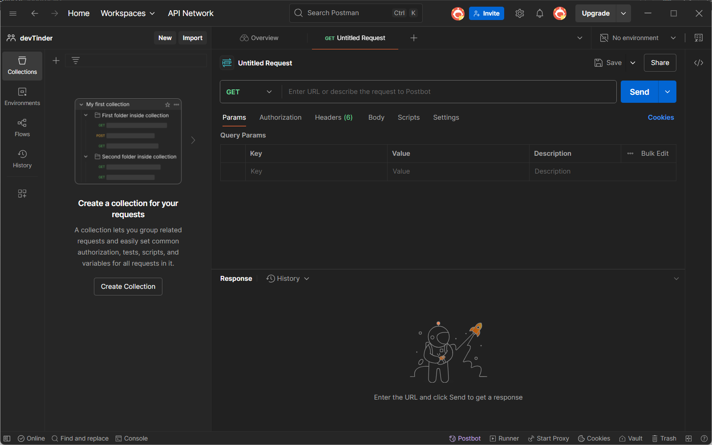

# Episode-04 | Routing and Request Handlers

## Q. Will sequence is matter in routing?
Yes, When a request is coming on server, the code will start running from the top and also start matching routes from the top. So, if you have a route that matches a request before a more specific route, the more specific route will never be reached.

---

## Testing the APIs
Browser is not used to test APIs, it is worst way. There are many tools available to test APIs like Postman that is used commonly in industry or you can use `curl` command in terminal.
```shell
$ curl http://localhost:3000/user
> {"name":"John Doe","age":30}
```

---

## Postman
Postman is a tool for building, tasting, and managing APIs together. It speed up the API developement process through team collabaration, automated testing, and easy debugging. To install it follow the steps below:
- Go to [Postman Download Page](https://www.postman.com/downloads/)
- Download the version for your operating system.
- Install it like any other application.
- Open Postman and create a new account.
- Create a workspace and collection for your APIs.
- Click on the "New" button to create a new request.
- Select the request type (GET, POST, PUT, DELETE, etc.) and enter the URL of your API.
- Click on the "Send" button to send the request and see the response.



---

## Handling different HTTP methods
To handle different HTTP methods doesn't use `app.use()` because it allow all HTTP method. Instead, use the specific method functions like `app.get()`, `app.post()`, `app.put()`, and `app.delete()`.

```javascript
app.get("/user", (req, res)=>{
  console.log("responded");
  res.send({name: "Pratik", city: "Jaipur"});
})

app.post("/user", (req, res)=>{
    // DB operation to save user data
  res.send("User data saved to DB");
})
```
Now, there API doesn't work for random HTTP methods.

---

## String Patterns in Routing
| **Pattern Symbol**  | **Description**                                                             | **Example Matches**                                 |
|---------------------|-----------------------------------------------------------------------------|-------------------------------------------------|
| `/ab?c`             | `?` means `b` is optional.                                                  | `/abc`, `/ac`                                   |
| `/ab+c`             | `+` means `b` appears one or more times.                                    | `/abc`, `/abbc`, `/abbbc`                       |
| `/ab*cd`            | `*` means any characters (including none) between `ab` and `cd`.            | `/abcd`, `/abxyzcd`, `/ab123cd`                 |
| `/a(bc)?d`          | `()` groups `bc`, `?` makes group optional.                                 | `/ad`, `/abcd`                                  |
| `/ab[0-9]+c`        | Regex: one or more digits between `ab` and `c`.                             | `/ab1c`, `/ab123c`                              |
| `/ab$`              | `$` means route ends with `ab`.                                             | `/ab`, `/cab`, `/123ab`                         |
| `/^abc`             | `^` means route starts with `abc`.                                          | `/abc`, `/abcd`, `/abc123`                      |
| `/ab{n}c`           | `{n}` means `b` appears exactly `n` times.                                  | `/abc` (if n=1), `/abbc` (if n=2)               |
| `/ab{n,}c`          | `{n,}` means `b` appears at least `n` times.                                | `/abbc`, `/abbbc` (if n=2)                      |
| `/ab{n,m}c`         | `{n,m}` means `b` appears at least `n` and at most `m` times.               | `/abbc` (if n=2, m=2), `/abbbc` (if n=2, m=3)   |

---

### Remember
Now, the version of ExpressJS is 5.x.x, and there route string matching is strict. So it may be crash your server. If you want to use these string patterns, you need to downgrade the ExpressJS version to 4.x.x. You can do this by running the following command:
```bash
npm install express@4
```
Or write string patterns in regex format like this:
```javascript
app.get(/^\/ab[0-9]+c$/, (req, res) => {
    res.send("Matched with regex");
});
```

---

## Data Extraction from URL
### 1. Query Params
On the `request` object, you can access the query parameters using `req.query`.
```javascript
app.get("/user", (req, res)=>{
    console.log(req.query); // { name: 'John', age: '30' }
    res.send({name: req.query.name, age: req.query.age});
})

// URL: http://localhost:3000/user?name=John&age=30
// You can pass multiple query parameters by separating them with `&`
```

---

### 2. Dynamic Routes
You can also create dynamic routes that can accept parameters from the URL. For example, you can create a route that accepts a user ID and returns the user data for that ID.
```javascript
app.get("/user/:id", (req, res)=>{
    console.log(req.params); // { id: '123' }
    res.send({id: req.params.id, name: "John Doe"});
})

// URL: http://localhost:3000/user/123
// You can access the dynamic parameter using `req.params`
```

---

[**Previous**](../S02%20Episode%203/README.md) | [**Next**](../S02%20Episode%205/README.md)