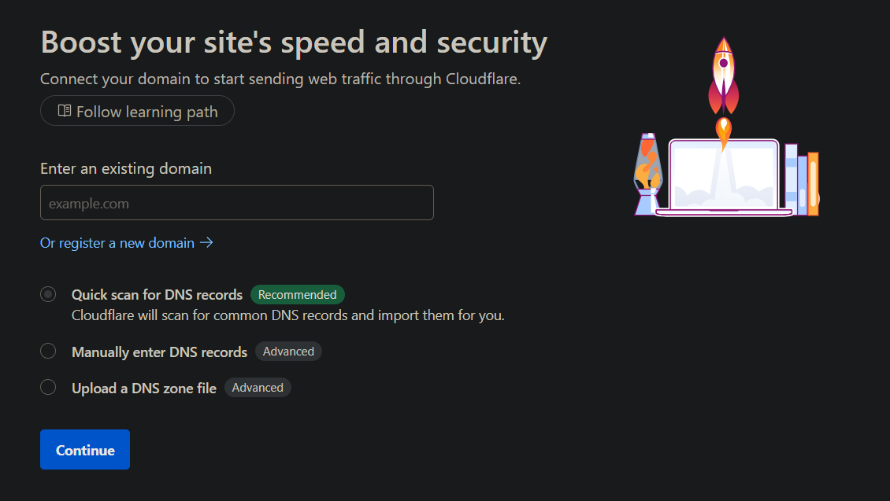
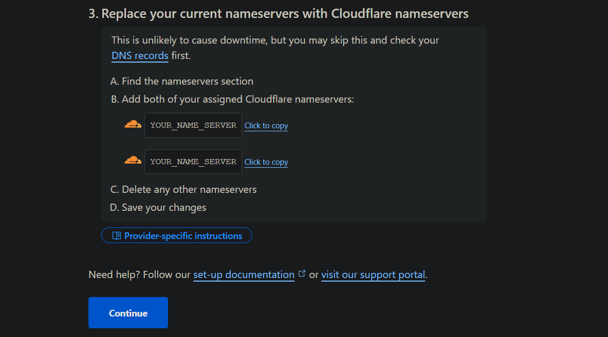

# Episode-03 | Adding Custom Domain Name

## Need a Domian provider?

First, you have to choose a domain provider. Here are some popular ones:

- [Namecheap](https://www.namecheap.com/)
- [GoDaddy](https://www.godaddy.com/)
- [Google Domains](https://domains.google/)
- [Name.com](https://www.name.com/)
- [Hostinger](https://www.hostinger.com/domains)
- [.Tech Domains](https://get.tech/)

For this project I used Godaddy, follow these steps to add a custom domain name to your application:

- Create a account on [Godaddy](https://www.godaddy.com/) or your preferred domain provider.
- Godaddy is paid, if you can afford, continue with Godaddy else don't worry, you can use the free `.tech` domain from the **GitHub Student Developer Pack** if you are a student. To get free [follow](#tech-domain)
- Search for a domain name you like and purchase it.
- Choose the available domain extension you want (e.g., .com, .net, .org, etc.).
- Once you have purchased the domain, you will have access to the domain management dashboard.
- Go to "my products" and find your domain in the list.
- Click on "Manage" button.
- To set SSL certificate, we use Cloudflare, so we need to point our domain to Cloudflare.
- You can set SSL on Godaddy, but it is not free, so we will use Cloudflare for that and it provide lot of other features as well.
- Go to [Cloudflare](https://www.cloudflare.com/) and create an account if you don't have one.
- Go to dashboard and Click on "Add a domain name" button.
- Enter your domain name, select "Quick Sacn" and click to continue.

- Choose the free plan and click to continue.
- Click on activation button bellow
- See your assigned nameservers, you will need to update your domain nameservers on Godaddy or your platform.

- Go back to Godaddy dashboard and click on nameservers.
- **nameservers** tell who will manage your DNS records, so we will change it with Cloudflare nameservers.
- Click on "Change" button and select "Custom" option.
- Enter the nameservers provided by Cloudflare and click on "Save" button.
- It will take some time to propagate the changes, so wait for a few minutes (usually 5-10 minutes).
- There are 2 things:
  - **Domain Registrar**: The place where you purchased your domain name (e.g., Godaddy).
  - **Nameservers**: The servers that manage your DNS records (e.g., Cloudflare).
- Once the nameservers are updated, go back to Cloudflare dashboard.
- Now go to "DNS" tab in Cloudflare dashboard, you can find the DNS tab in the left sidebar.
- Delete both default `A` records that are created by default.
- Click on "Add record" button and select `A` record.
- Enter the following details:
  - **Type**: A
  - **Name**: your domain name (e.g., `example.com` or `www.example.com`)
  - **IPv4 address**: Your server's public IP address (you can find it in your hosting provider's dashboard)
  - **TTL**: Auto
  - **Proxy status**: Proxied (this will enable Cloudflare's features like SSL, caching, etc.)
- Click on "Save" button to save the record.
- There you will find a `CNAME` record for `www` subdomain, you can leave it as it is.

## Securing Domain with SSL
To secure your domain with SSL, follow these steps:
- Go to "SSL/TLS" tab in Cloudflare dashboard.
- Click on "Configure" button, then select custom SSL/TLS option.
- Select "Flexible" SSL option, this will encrypt the connection between the user and Cloudflare.
- If you want to use "Full" SSL option, you need to install an SSL certificate on your server as well.
- For now, we will use "Flexible" SSL option, it is enough for our project.
- No go to "Edge Certificates" tab in Cloudflare dashboard.
- Find the "Always Use HTTPS" option and enable it, this will redirect all HTTP requests to HTTPS.
- Find the "Automatic HTTPS Rewrites" option and enable it, this will rewrite all HTTP links to HTTPS.

## .Tech Domain
Godady is not free, so I used [.tech domain](https://get.tech/) for this project. `.tech` domain is also not free, but I got it free for 1 year with the "GitHub Student Developer Pack". If you are a student, you can get it for free as well. Here are the steps to get it:
- Go to [GitHub Student Developer Pack](https://education.github.com/pack) page.
- To redeam it, follow the [Sheryians Coding School Video](https://youtu.be/pq0k5OqnML4?feature=shared) YouTube Video or find it yourself
- Sign up with your student email address.
- Once you are verified, you will get access to the pack.
- You will find a lot of free offers, including `.tech` domain.
- Click on the `.tech` domain offer and follow the instructions to get your free domain.
- Signup with github account and verify your email address.
- Your amount will becomes $0.00 and you can proceed to checkout.
- Once you have purchased the domain, you can follow the same steps as above to set it up with Cloudflare.