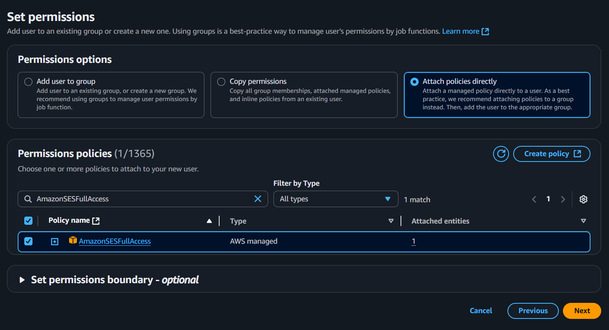

# Episode-04 | Sending Emails using AWS Simple Email Service (SES)

AWS provide lot of services, one of them is Simple Email Service (SES) which allows you to send emails from your application. In this episode, we will learn how to send emails using AWS SES. Follow these steps:

1. Login to AWS console and make sure you are selected in the correct region (e.g., `as-south-1`).
2. Before creating SES account, you need to create an IAM user with SES permissions.
3. Go to IAM service in AWS console and click on "Users".
4. Click on "Add user" button.
5. Enter a username (e.g., `ses-user`) and click "Next".
6. Select "Attach policies directly" and search for `AmazonSESFullAccess` policy. Select it and click "Next".
   
7. Review the user details and click "Create user".
8. Once user is created, Go back to AWS Console and search for "SES" in the services.
9. You will see "Amazon Simple Email Service", click on it. Make sure you are in the correct region.
10. You will see "Get started" button, click on it. By clicking it, you redirect to creating an entity.
11. Enter your email address in the "Email address" field and click "Next".
12. Enter your domain name in the "Domain" field (e.g., `example.com`) and click "Next".
13. Again Click on Next. Review the details and click "Get Started".
14. Now open your email inbox. You will see a confirmation email sent to your email address, open it and click on the confirmation link.
15. Once you confirm your email address, go back to AWS SES dashboard.
16. Now you will see 3 `CNAME` DNS records, you need to add them to your domain's DNS records.
17. Go to Cloudflare dashboard and click on "DNS" tab.
18. Once you add come back to AWS SES dashboard, you will see a message that says "Domain verification in progress". It may take some time to verify your domain. (usually 5-10 minutes).
19. Once your domain is verified, you will see a message that says "Domain verified".
20. Now go to "Get Set up" tab in AWS SES dashboard.
21. You will see a message that says "Your account is in the SES sandbox". This means you can only send emails to verified email addresses.
22. To move out of the sandbox, you need to request production access. Click on "Request production access" button.
23. Fill out the form with your details and click "Submit".
24. Once your request is approved, you will be able to send emails to any email address

## Sending Emails using AWS SES

Now we need 2 things to send emails using AWS SES:

- SES-SDK (Software Development Kit) for Node.js
- AWS credentials (Access Key ID and Secret Access Key)
- Follow these steps to get your AWS credentials:
  - Go to IAM service in AWS console and Click on "My Security Credentials" in the top right corner.
  - Find the "Access keys" section and click on "Create access key" button.
  - Copy both Access Key ID and Secret Access Key and save them to a `.env` file in your project root directory.
- Install the AWS SDK for Node.js by running the following command:
  ```bash
    npm i @aws-sdk/client-ses
  ```
- Make sure your email address is verified in AWS SES, otherwise you will not be able to send emails. To verofy create an entity in AWS SES, follow the steps mentioned above.
- Go to AWS SES docs to learn how to send emails using AWS SES SDK for Node.js: [AWS SES Node.js SDK](https://docs.aws.amazon.com/sdk-for-javascript/v3/developer-guide/javascript_ses_code_examples.html) or also you can find the code example on the [GitHub repository](https://github.com/awsdocs/aws-doc-sdk-examples/blob/main/javascriptv3/example_code/ses/src/ses_sendemail.js#L16)
- or you can use the following code to send emails using AWS SES:
  - Create a file named `sendEmail.js` in your project root directory and add the following code:

```javascript
const { SendEmailCommand } = require("@aws-sdk/client-ses");
const { sesClient } = require("./sesClient");

const createSendEmailCommand = (toAddress, fromAddress) => {
  return new SendEmailCommand({
    Destination: {
      /* required */
      CcAddresses: [
        /* more items */
      ],
      ToAddresses: [
        toAddress,
        /* more To-email addresses */
      ],
    },
    Message: {
      /* required */
      Body: {
        /* required */
        Html: {
          Charset: "UTF-8",
          Data: "HTML_FORMAT_BODY",
        },
        Text: {
          Charset: "UTF-8",
          Data: "TEXT_FORMAT_BODY",
        },
      },
      Subject: {
        Charset: "UTF-8",
        Data: "EMAIL_SUBJECT",
      },
    },
    Source: fromAddress,
    ReplyToAddresses: [
      /* more items */
    ],
  });
};

const run = async () => {
  const sendEmailCommand = createSendEmailCommand(
    "recipient@example.com",
    "sender@example.com"
  );

  try {
    return await sesClient.send(sendEmailCommand);
  } catch (caught) {
    if (caught instanceof Error && caught.name === "MessageRejected") {
      /** @type { import('@aws-sdk/client-ses').MessageRejected} */
      const messageRejectedError = caught;
      return messageRejectedError;
    }
    throw caught;
  }
};

// snippet-end:[ses.JavaScript.email.sendEmailV3]
module.exports = { run };
```

- Create a file named `sesClient.js` in your project and add the following code:

```javascript
const { SESClient } = require("@aws-sdk/client-ses");

// Set the AWS Region.
const REGION = "ap-south-1";
// Create SES service object.
const sesClient = new SESClient({
  region: REGION,
  credentials: {
    accessKeyId: process.env.AWS_ACCESS_KEY,
    secretAccessKey: process.env.AWS_SECRET_KEY,
  },
});
module.exports = { sesClient };
```

## Executing run function

I want to send mail when user recieve a new request. So I call run() function inside `/requestRouter.js` file. You can call it anywhere you want to send an email. Here is the code:

```javascript
requestRouter.post(
  "/request/send/:status/:toUserId",
  userAuth,
  async (req, res) => {
    try {
      // Other code...

      const response = await sendEmail.run();
      console.log(response);

      res.json({
        message: "Connection request sent!",
      });
    } catch (err) {
      res.status(400).send("ERROR: " + err.message);
    }
  }
);
```

- You can make it dynamic by passing the `toAddress` and `fromAddress` as parameters to the `createSendEmailCommand` function. Find full code on [requestRouter.js](https://github.com/opdsbanasya/devTinder/blob/main/backend/src/routes/requestRouter.js#L6)

---

---

[**Previous**](../S03%20Episode%203/README.md) | [**Next**](../S03%20Episode%205/README.md)